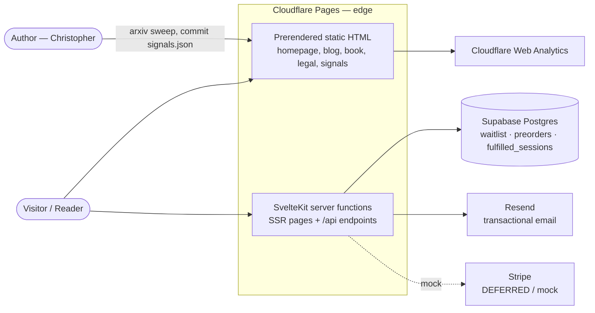

# Site Architecture & API Map

> **Living document.** Update it in the same change whenever you add/remove a route or
> API endpoint, change a render mode (prerender ↔ SSR), touch the data model, or add an
> external integration. If this file and the code disagree, the code wins — fix this file.
>
> **Last updated:** 2026-06-30 · **Branch:** `homepage-redux-jun2026`
> **Conventions:** [C4 model](https://c4model.com/) for the context/container views,
> [arc42](https://arc42.org/) section ordering. Diagrams are Mermaid (render on GitHub).

---

## 1. System context (C4 L1)



**Shape of the system:** read-heavy, write-light content site. ~95% of pages are static
HTML at the edge; the only writes are email signups and preorders. This is *not* a
low-latency transactional system, and the architecture should keep following that.

---

## 2. Tech stack

| Layer | Choice | Notes |
|-------|--------|-------|
| Framework | SvelteKit 2 + Vite 5 | `adapter-auto` (deploys to Cloudflare Pages) |
| Styling | Tailwind 3 + component CSS | dark-only theme; tokens in `src/lib/styles/theme.css` |
| Content (book) | `src/lib/bookContent.js` + md loaders | static, build-time |
| Content (blog) | per-post dirs under `src/routes/blog/` | static |
| Content (signals) | `src/lib/data/signals.json` (committed) | regenerated by arXiv sweep, **needs rebuild to update** |
| Database | Supabase Postgres | RLS-protected; see §5 |
| Email | Resend | transactional only; sandbox domain until custom domain verified |
| Payments | Stripe | **deferred** — mock flow only (see §8, §10) |
| Analytics | Cloudflare Web Analytics | no GA/behavioral tracking |

---

## 3. Route map (pages) — render mode

Render mode is the load-bearing architectural property here. **Default is prerender**
(set in `src/routes/+layout.server.js`); dynamic routes opt out with
`export const prerender = false`.

| Route | Mode | Why | Data source |
|-------|------|-----|-------------|
| `/` | **Prerender** | static landing | none |
| `/about`, `/accessibility`, `/disclaimer`, `/policies`, `/terms` | **Prerender** | static | none |
| `/checklist` | **Prerender** | static; email gate is client-side | none |
| `/launch` | **Prerender** | static; preorder form posts to API | none |
| `/signals` | **Prerender** | static feed | `signals.json` (build-time) |
| `/blog` + ~15 posts | **Prerender** | static | `blog/+page.server.js` list + per-post dirs |
| `/book` + 40+ sections | **Prerender** | static | `bookContent.js`; `[sectionId]` uses `entries()` |
| `/early-access` | **SSR** | live waitlist count + recent signals | `getWaitlistCount()`, `signals.json` |
| `/early-access/success` | **SSR** | reads `session_id`/`email` query params | query params, optional Supabase |
| `/unsubscribe` | **SSR** | reads `token` query param | Supabase (`waitlist`) |

> Adding a page? It prerenders by default. If it reads query params, cookies, or live DB
> data per request, add `export const prerender = false` to its `+page.server.js`/`+page.js`
> **and add a row here.**

---

## 4. API map (endpoints)

All under `src/routes/api/*/+server.js`. POST endpoints guard with an **origin check**
(reject cross-site) and JSON content-type check; the write endpoints add a **honeypot**
and **in-memory rate limit** (`src/lib/server/rateLimit.js` — see §10 caveat).

| Endpoint | Method | Purpose | Reads/Writes | Auth/guard |
|----------|--------|---------|--------------|------------|
| `/api/waitlist` | POST | Email signup (homepage, early-access, etc.) | **W** `waitlist`; fires welcome email | origin, content-type, honeypot, rate-limit (5/10min) |
| `/api/checklist-email` | POST | Email the readiness checklist (no DB write) | sends via `sendChecklistEmail` (Resend) | honeypot, rate-limit (hourly), email validation |
| `/api/preorder` | POST | Author's/Standard edition preorder | **W** `preorders`; confirmation email | origin, honeypot |
| `/api/preorder-count` | GET | Preorder count for social proof | **R** `preorders` (view) | public, gated by threshold |
| `/api/unsubscribe` | POST | Mark a waitlist row unsubscribed | **W** `waitlist.unsubscribed_at` | token in body |
| `/api/stripe-checkout` | POST | Create checkout session | none (**mock**: redirects to success) | origin |
| `/api/featured-posts` | GET | Featured blog posts (Cloudflare-cached) | **R** static blog data | public |
| `/api/latest-post` | GET | Most recent blog post | **R** static blog data | public |
| `/api/timeline` | GET | Paginated timeline data | **R** static data | public |
| `/api/fetch-title` | GET | Fetch a URL's `<title>` (link preview) | external fetch | https-only + `ALLOWED_HOSTS` allowlist + private-IP block |
| `/sitemap.xml` | GET | Dynamic sitemap (live routes + book sections) | **R** route glob + `bookContent` | public, `max-age=3600` |

> `/api/fetch-title` fetches a caller-supplied URL but is already SSRF-guarded: https-only,
> an `ALLOWED_HOSTS` allowlist, and a private/loopback/link-local IP block. Keep
> `ALLOWED_HOSTS` current as the only maintenance task.

---

## 5. Data model (Supabase Postgres)

All tables have **Row Level Security ON**; `anon` may only INSERT. Reads use the
service-key admin client server-side (`src/lib/server/supabaseAdmin.js`), never the browser.

```
waitlist                              preorders                         fulfilled_sessions
─────────                             ─────────                         ──────────────────
id              uuid pk              id            uuid pk             session_id  text pk
email           text                 email         text                email       text
source          text                 name          text                created_at  timestamptz
newsletter_consent   bool            edition_type  text (regular|authors)
book_release_consent bool            copy_number   int (1-100 | null)   (idempotency guard so a
created_at      timestamptz          status        text (pending…)       success page emails once)
unsubscribe_token uuid (unique idx)  source        text
unsubscribed_at timestamptz          honeypot_flag bool
                                     created_at    timestamptz
  RLS: anon INSERT only              uniq(email, edition_type)
                                       RLS: anon INSERT only
```

Migrations live in `sql/` (`001_waitlist` → `004_fulfilled_sessions`), applied manually in
the Supabase SQL editor. `preorder_counts` is a view exposing aggregate counts to `anon`.

---

## 6. Key data flows

**Signup (waitlist / early-access):**
```
form POST /api/waitlist → origin+honeypot+ratelimit checks → INSERT waitlist
  → (fire-and-forget, waitUntil) Resend welcome email → 201
  early-access page: on 5xx/network fail → buffer email in localStorage, retry next load
```

**Preorder (Author's Edition):**
```
/launch form → POST /api/preorder → INSERT preorders (copy_number assigned for authors)
  → confirmation email → success state
```

**Unsubscribe:** email link → `/unsubscribe?token=…` (SSR) → validate token →
POST `/api/unsubscribe` → set `unsubscribed_at`.

**Purchase (deferred):** `/early-access` currently captures email only. When Stripe is wired,
`/api/stripe-checkout` creates a real session and `/early-access/success` verifies payment +
sends the download via `fulfilled_sessions` idempotency. Today it runs in mock mode.

---

## 7. Rendering & caching strategy

- **Static pages** (§3) are prerendered to HTML and served from the Cloudflare edge — the
  primary defense against a launch traffic spike. Security headers come from `static/_headers`
  (these pages bypass `hooks.server.js`).
- **SSR pages + API** run as server functions; security headers come from
  `src/hooks.server.js`. `getWaitlistCount()` is cached 60s in-process.
- **Signals data** is build-time static — refreshing the feed requires a rebuild/redeploy,
  not just a data write. (Acceptable: it's a research digest, not real-time.)

---

## 8. External integrations

| Service | Used for | Failure mode | Key/config |
|---------|----------|--------------|------------|
| Supabase | waitlist, preorders, fulfilled_sessions | insert error → client buffers lead (early-access) | `SUPABASE_*`, `PUBLIC_SUPABASE_*` |
| Resend | welcome + preorder + download emails | non-fatal: logged, signup still succeeds | `RESEND_API_KEY`, `EMAIL_FROM` (sandbox until custom domain) |
| Stripe | payments (Phase 2) | mock mode redirects to success, no charge | `STRIPE_*` (placeholder) |
| Cloudflare | hosting + edge + Web Analytics | — | platform |
| YouTube / Substack / Spotify | embeds | CSP-allowlisted in `hooks.server.js` + `_headers` | — |

---

## 9. Security model (summary)

- RLS everywhere; `anon` INSERT-only; service key server-only; `.env` gitignored & untracked.
- POST endpoints: origin check + content-type guard + honeypot.
- Headers: CSP, HSTS, X-Frame-Options, Referrer-Policy, Permissions-Policy — in **both**
  `hooks.server.js` (SSR) and `static/_headers` (prerendered). Keep them in sync.
- `script-src 'unsafe-inline'` is present (SvelteKit hydration) — a known CSP softening.

---

## 10. Known gaps / follow-ups

| Item | Severity | Notes |
|------|----------|-------|
| Rate limiter is in-memory / per-isolate | P1 | Ineffective across serverless isolates. Durable upgrade = Supabase counter (host-portable, matches adapter-auto). Layered defenses bound the damage for launch. |
| Resend on sandbox domain | P1 | Verify a custom domain + update `EMAIL_FROM` before marketing push (deliverability). |
| `/api/fetch-title` SSRF surface | P2 | Add URL allowlist before production reliance. |
| Stripe deferred | Phase 2 | Mock flow only; wire real keys later. `/api/stripe-checkout` auto-disables mock when keys present. |
| Adapter is `adapter-auto` | low | Pin `@sveltejs/adapter-cloudflare` if/when KV bindings are wanted. |

See `docs/PROJECT-STATUS.md` for product status and the launch premortem
(`~/.claude/plans/on-the-surviving-the-graceful-ripple.md`) for the full reasoning.

---

## 11. Change log

- **2026-06-30** — Initial architecture + API map. Reflects launch-hardening (prerendering,
  fire-and-forget welcome email, lead-capture fallback, `_headers`) committed in `f325373`.
